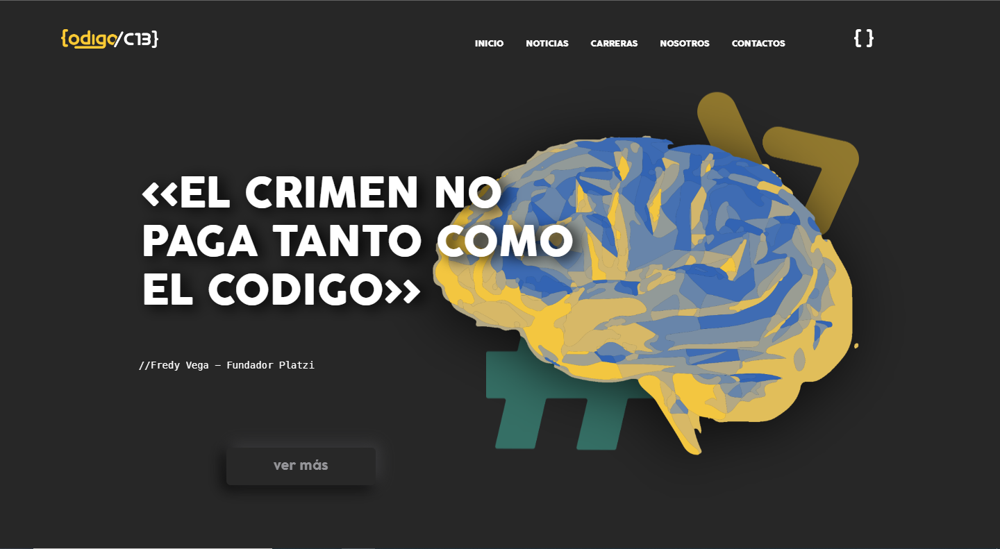

# Proyecto integrador - Escuela Codigo-C13

Este proyecto se hizo con la finalidad de proporcionar un medio de informacion por el cual la escula de codigo comuna 13 podra dar a concer su proceso de impacto social con la comunidad beneficiaria del proyecto creado desde la corporacion artistica SonBata.
## pantallazos

